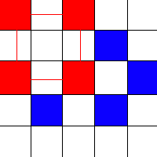
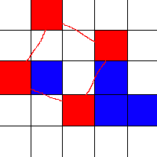

# Avoid the Square

go-squares is an engine for the game of Avoid the Squares. The point of the game is to avoid making a square with your pieces. Each player takes turns placing a piece on the board, and the first person to make a square using their own pieces loses.

## Examples

This is a square

This is a non-trivial square

In both of these situations, red loses.